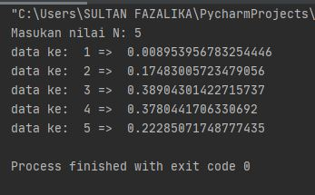
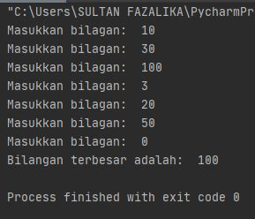
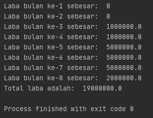

#TUGAS PRAKTIKUM 3
##Latihan1.py
- Tampilkan **n** bilangan acak yang lebih dari 0,5
- Nilai **n** diisi pada saat runtime
- Anda bisa menggunakan kombinasi **while** dan **for** untuk menyelesaikannya
- Gunakan fungsi `random()` yang dapat diimport terlebih dahulu

**Pejelasan singkat dari beberapa fungsi yang dipakai** :
- `print()` : berfungsi untuk mencetak atau menampilkan objek ke perangkat keluaran (layar) atau ke file teks.
- `for` : Looping/pengulangan.
- `import` : fungsi lanjut yang dipanggil oleh statement import.
- `random` : fungsi lanjut yang dipanggil oleh statement import.
- `range()` : merupakan fungsi yang menghasilkan list. Fungsi ini akan menciptakan sebuah list baru dengan rentang nilai tertentu.
- `uniform()` : fungsi lanjut yang dipanggil oleh statement import.

**OUTPUT Latihan1.py**

##Latihan2.py
-Buatlah program untuk menampilkan bilangan **terbesar** dari **n** buah data yang diiput

**Pejelasan singkat dari beberapa fungsi yang dipakai** :
- `item=[]` : berfungsi sebagai list bilangan yang akan di print.
- `for` : Looping/pengulangan.
- `print()` : berfungsi untuk mencetak atau menampilkan objek ke perangkat keluaran (layar) atau ke file teks.

**OUTPUT Latihan2.py**

##Program1.py
- Buatlah program sederhana dengan perulangan **program1.py**
- Seorang pengusaha menginvestasikan uangnya unntuk memulai usahanya dengan modal awal 100 juta.
- Pada bulan pertama dan kedua belum mendapatkan laba
- Pada bulan ketiga baru mulai mendapatkan laba sebesar 1%
- Pada bulan ke 5 mendapat laba sebesar 5%
- Pada bulan ke 8 mengalami penurun keuntungan hingga 3%
- Hitung total keuntungan selama 8 bulan berjalannya usaha

**Pejelasan singkat dari beberapa fungsi yang dipakai** :
- Pertama kita tulis `modal=100000000` sebagai dasar perhitungan untuk laba keuntungan.
- Kedua, disini kita tau ada 4 jenis presentase yg berbeda selama 8 bulan, yaitu `0%, 1%, 5%, dan 2%`.
- Ketiga, buat rumus dasar untuk menghitung laba a,b,c,d(untuk tiap jenis persentasenya) dengan rumus `modal*x`(x=persentase).
- Keempat buat rumus untuk totalnya
- Terakhir rangkai kodenya.

**OUTPUT Program1.py**

